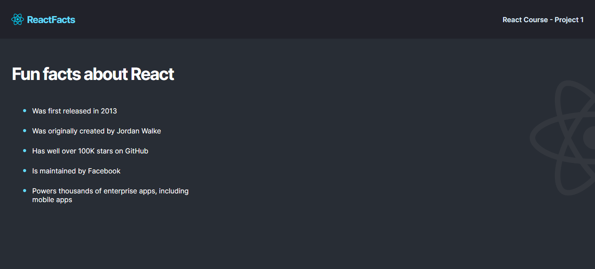

# Fun facts about React

This is my first React App 9developed + deployed on Netlify) Ever, It's about a static website that tells us fun facts about this famous library.
I had the chance to practice old techs: HTML, CSS, JavaScript, ES6, and Sass.
And also to learn more about React, and how tu install it via Nodejs => then npm => then Vite, and run multiple tools via CLI such as, dev tools, and Build. And finally deploy this app on Netlify.

