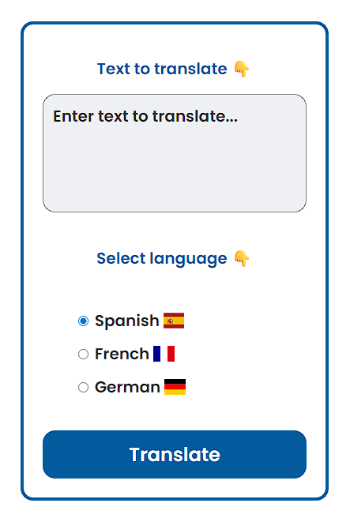

# Translation App

A simple and efficient app for translating text between multiple languages.  
Powered by the OpenAI API (GPT-5-Nano).

## Features

- Supports various languages
- Fast and accurate translations
- User-friendly interface
- Utilizes GPT-5-Nano for high-quality results

## Getting Started

1. Clone the repository.
2. Install dependencies.
3. Run the app locally.

## Live Demo

https://abd-translation-app.netlify.app/

