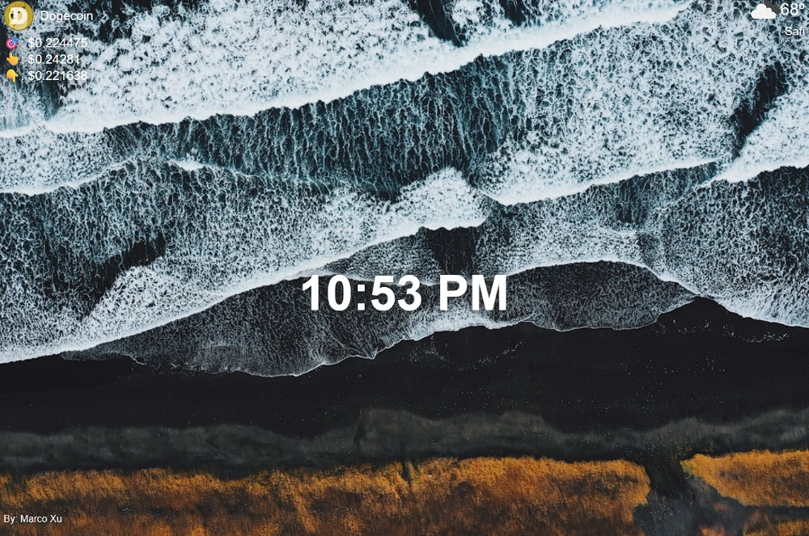

# Dashboard Chrome Extension

A customizable dashboard Chrome extension built with JavaScript, designed to enhance your new tab experience by displaying useful information such as weather, quotes, and more.

## Features

- Displays current weather information
- Customizable dashboard layout
- Async API calls for dynamic content

## Installation

1. Clone or download this repository to your local machine.
2. Open Chrome and navigate to `chrome://extensions/`.
3. Enable "Developer mode" (top right).
4. Click "Load unpacked" and select the project folder.

## Usage

- Open a new tab to view your dashboard.
- Enjoy real-time updates and useful information.

## Technologies Used

- JavaScript (ES6+)
- HTML & CSS
- Chrome Extension APIs
- External APIs (Weather, Stocks)

## Contributing

Feel free to fork the repository and submit pull requests for improvements or new features.

