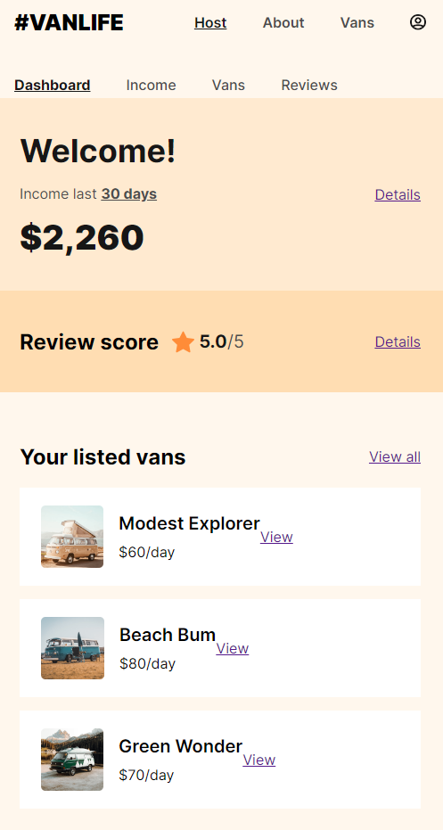

# VanLife App

This is my first React Router App developed + deployed on Netlify, I developed a vans app with two paradigms of react fetching data, the first is using useEffect, and because the problem of request waterfall, I completly switched to use the loaders, actions and deffered data features that come with the data layer API from React Router v6.4, and coding both the happy path and also the sad path with catching errors with errorElement and display them to the screen, as well as showng loders while fetching data to enhance the overall experience
I had the chance to practice old techs: HTML, CSS, JavaScript, ES6, fetch API, Async/Await, and Sass.
And also to learn more about
--React Components,
--Props,
--Conditional rendering,
--Pass object as props,
--Spread object as props
--States
--Event listeners in react
--Forms in react
--Manage Side effects and cleaning them up using useEffect Hook
--React Router 6.4
--Nested Routes
--Protected Routes
--Search Params and Links
--Loaders
--Actions
--Defered Data and Await
--Firebase

And how to install it via Nodejs => then npm => then Vite, and run multiple tools via CLI such as, dev tools, and Build. And finally deploy this app on Netlify.

# Live Demo

https://abd-vanlife.netlify.app/

