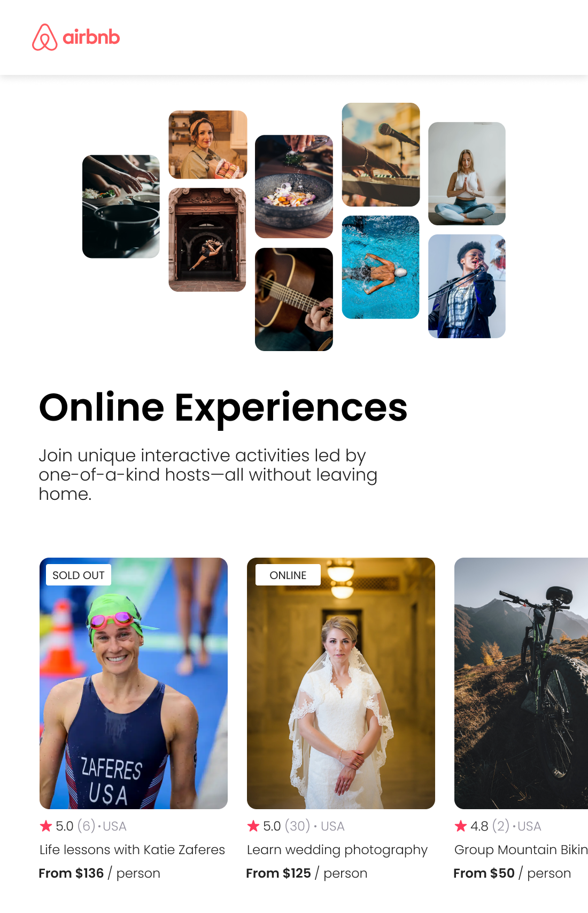

# Airbnb Experience

This is my Seconf React App developed + deployed on Netlify), It's about a static website that clones Airbnb Experience.
I had the chance to practice old techs: HTML, CSS, JavaScript, ES6, and Sass.
And also to learn more about
--React Components,
--Props,
--Conditional rendering,
--Pass object as props,
--Spread object as props

And how to install it via Nodejs => then npm => then Vite, and run multiple tools via CLI such as, dev tools, and Build. And finally deploy this app on Netlify.

# Live Demo

https://658af08e4f6415b398031712--zingy-tapioca-804447.netlify.app/

