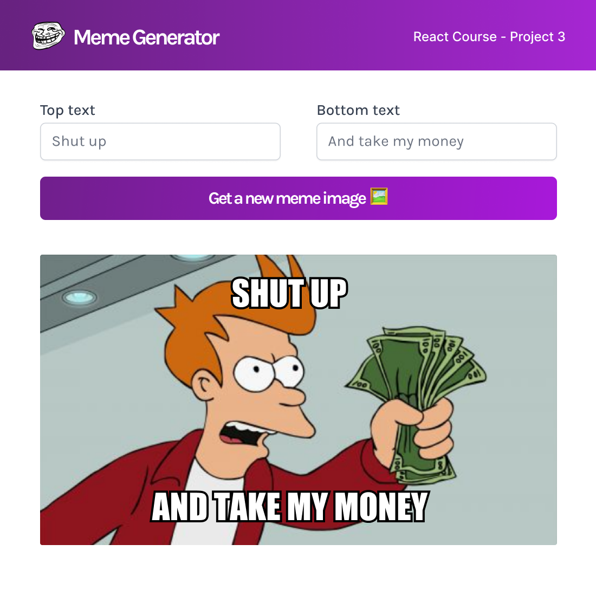

# Meme Generator App

This is my third React App developed + deployed on Netlify), It's about an app that calls an api requesting some meme images, then collect infos from a form to display it on a random meme image
I had the chance to practice old techs: HTML, CSS, JavaScript, ES6, fetch API, Async/Await, and Sass.
And also to learn more about
--React Components,
--Props,
--Conditional rendering,
--Pass object as props,
--Spread object as props
--States
--Event listeners in react
--Forms in react
--Manage Side effects and cleaning them up using useEffect Hook

And how to install it via Nodejs => then npm => then Vite, and run multiple tools via CLI such as, dev tools, and Build. And finally deploy this app on Netlify.

# Live Demo

https://65a891ec3419c520c6a72e6c--mellifluous-speculoos-8f8985.netlify.app/

