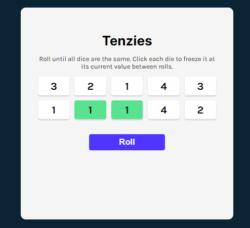

# Tenzies Game

This is my Fifth React App developed + deployed on Netlify), It is my first game devolped with React
I had the chance to practice old techs: HTML, CSS, JavaScript, ES6, and Sass.
And also to learn more about
--React Components,
--Props,
--Conditional rendering,
--Pass object as props,
--Spread object as props
--States
--Event listeners in react
--Forms in react
--Manage Side effects and cleaning them up using useEffect Hook

And how to install it via Nodejs => then npm => then Vite, and run multiple tools via CLI such as, dev tools, and Build. And finally deploy this app on Netlify.

# Live Demo

https://663837de470e755836c5ac19--stellular-fox-f99143.netlify.app/

